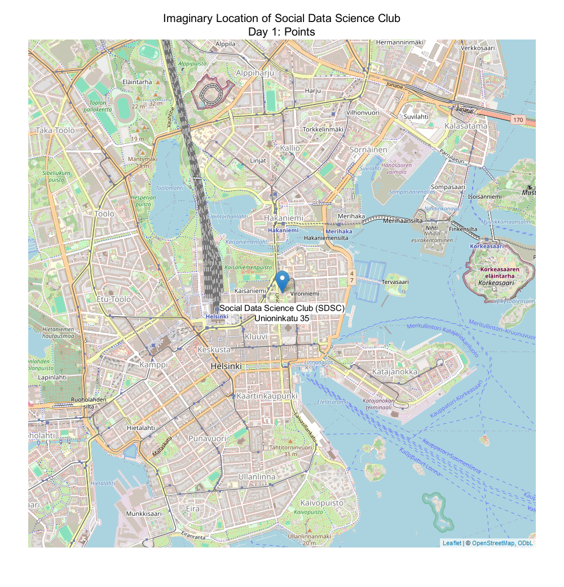
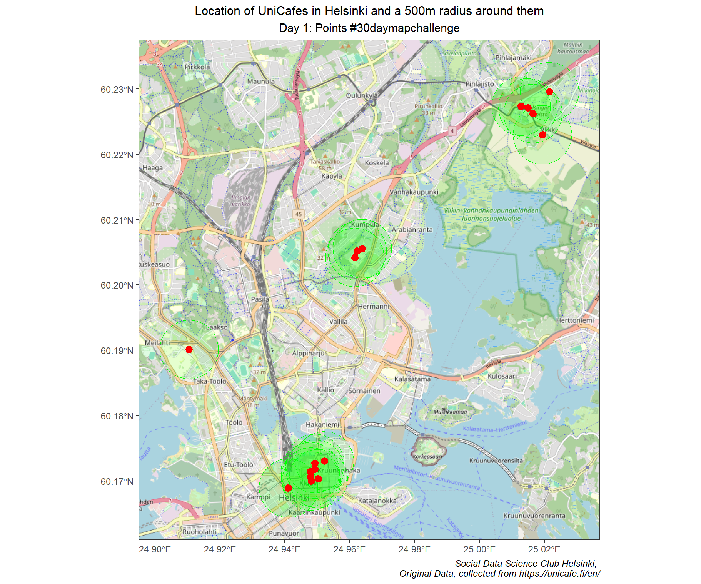

Our Social Data Science Club is joining the [**30-Day Map Challenge**](https://30daymapchallenge.com) this November! Each day, we’ll tackle a new theme, from points and lines to creative takes like vintage style and memory maps. It’s a fun way to experiment with social data and showcase unique maps.

Check back here on our Medium page daily—we’ll be sharing all our maps and insights throughout the month! Follow along with #30DayMapChallenge for updates.

Before starting out, here is the code of conduct for this challenge:

Code of Conduct:

**No matter if you are a GIS expert or never made a map before this challenge, everyone is welcome to participate, But keep in mind a few things: - All maps you publish have to be your original work. Don’t steal content from others. - Give credit to the original data source whenever possible. - The challenge is all about creativity, openness and the joy of beautiful maps and cartography. It is not a competition, - Be mindful in how you use AI tooling. If you generate all of your maps with generative AI tools, where's the fun? This is not a prompt engineering challenge. - Don’t be an asshole. Don’t harass or steal from others.**

To kick off #30daymapchallenge, I decided to create a map that marks our imaginary clubroom. The map is simple — a single point dropped at Unioninkatu 35, where the Faculty of Social Sciences of University of Helsinki is located. But it is more than just a location, it is a marker of our aspirations, a symbol of the community we’re building from scratch. The map is our way of saying, “Here we are!” as members of SDSC.

About: I have always wondered where Unicafes (University of Helsinki student cafes) are, and how well they are spaced out amongst each other. It is now time to start trying food from all these Unicafes! 😄.[Here](https://econvaibhav.github.io/unicafe_map.html) is a link to view the an interactive version of the map!
